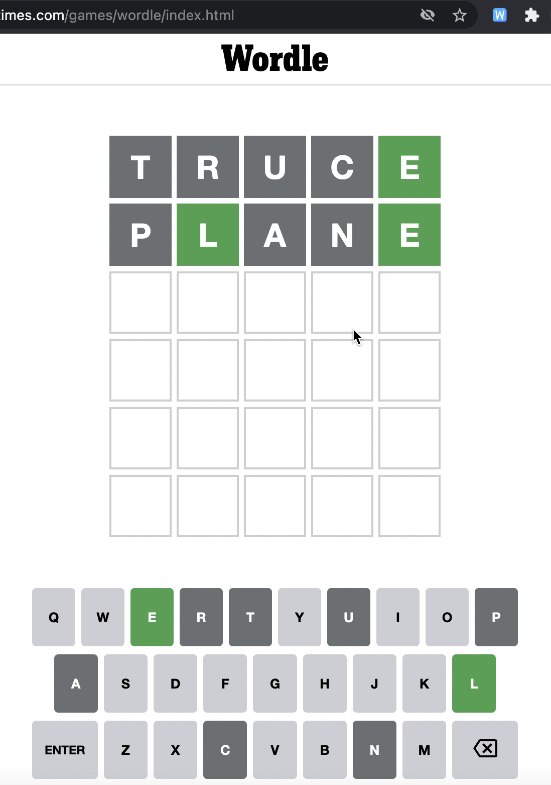

# Wordle Hints

A Chrome extension that reveals a hidden letter in <a href="https://www.nytimes.com/games/wordle/index.html">Wordle</a>

  

The local storge variable `nyt-wordle-state` stores the solution as well as the attempts made. Using the attempts information, we find the index of the tiles that have not yet been revealed. On clicking button to reveal tile, we choose any one of the tiles that has not been revealed and set the tile to the correct letter.

## Local Setup

Steps to setup locally can be found here https://developer.chrome.com/docs/extensions/mv3/getstarted/#unpacked